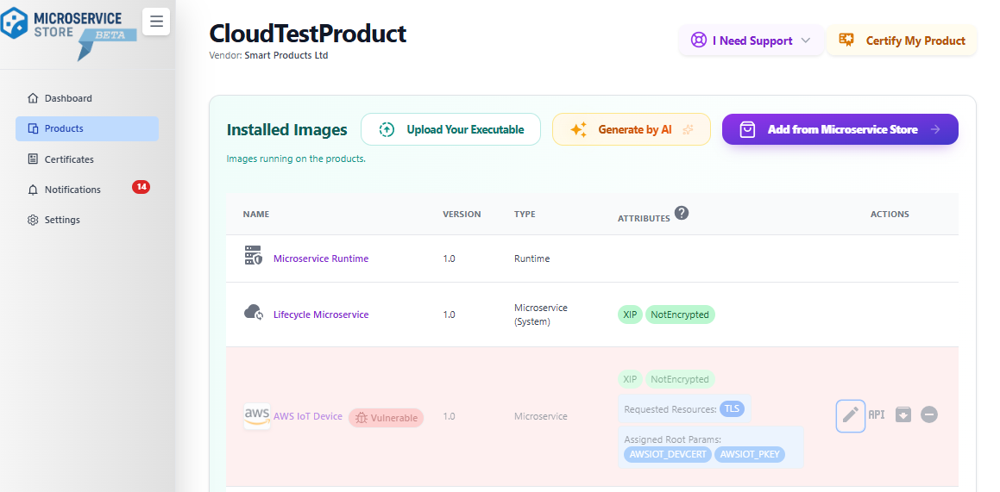
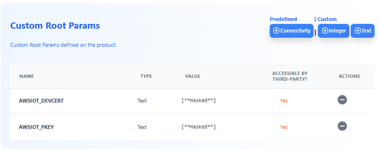
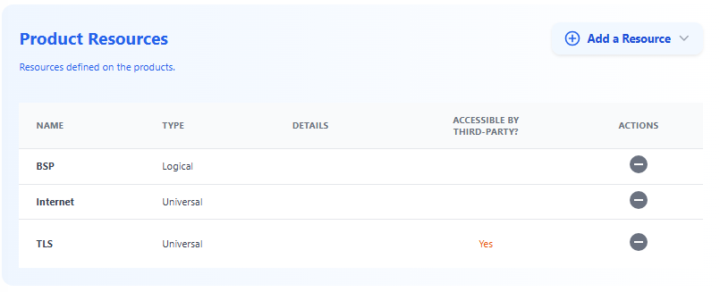
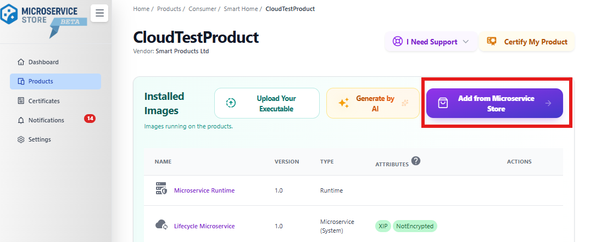
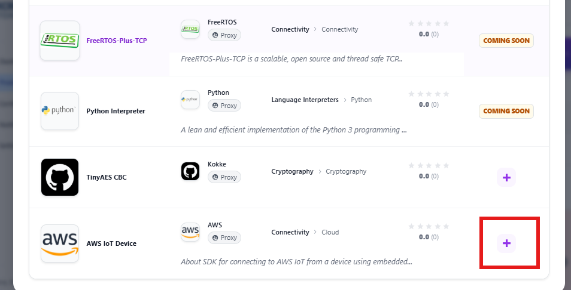
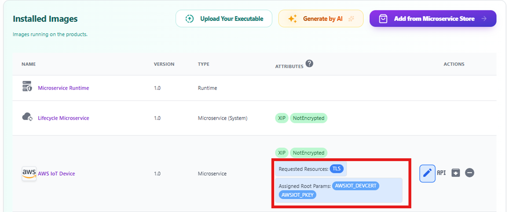
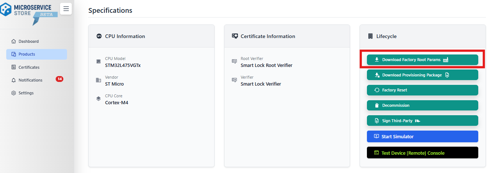

# AW IoT Device SDK as Microservice

## Overview

This repository is an open-source project that runs "AWS IOT Device SDK" as and isolated, access-controlled plug&play Microservices that can download and run with a one-click from Microservice Store.

> <b>IMPORTANT</b>: This is a proxy account, where ideally the library vendor shall maintain this repository.


> <b>IMPORTANT</b> As it is a proxy effort, Microservice Store does not guarantee the quality of the library, but "embedded Mircoservice Runtime" isolates and controls the access right, and in case of any malfunctioning in the vendor library, it quarantines the vendor library and report to the product vendors who uses this library.

Please see the example below that would have shown the AWS IoT Device SDK if it would have an vulnerability.



## How to Run

### 1. AWS IoT Console Configuration
Please create a device/thing in AWS IoT Console and generate your certificates, and download your "AWS IoT Device Certificate" and "AWS IoT Private Key" to your local.

You can follow the AWS instructions : https://docs.aws.amazon.com/iot/latest/developerguide/device-certs-create.html#device-certs-create-console

### 2. Microservice Store & Product Configuration
#### 2.1 Adding AWS Certificates to Product:</b> <br>
Add two root params to the Product Digital Twin.<br>

Go to Product Dashboard in Microservice Store. Go to Root Params section and add the following root params in text format.

i.  AWS IoT Device Certificate: Copy the Content in PEM Format

ii. AWS IoT Private Key : Copy the Content in PEM Format

> Please be sure these parameters are "Accessible by Third-Party" as "AWS IoT Microservice" will be a third-part for the product.



#### 2.2. Add TLS (Universal) Resource to Product
AWS IoT Microservice needs TLS from the target(embedded Microservice Runtime), so add TLS to product.

Go to Resource, add a Universal Resource and select TLS.



#### 2.3. Add AWS IoT Microservice to your product
Go to store and add the AWS IoT Microservice to your product.





#### 2.4. Assign AWS Certificates and TLS Resource to AWS IoT Microservice
Edit the AWS Microservice Store, and assign only the required entities to AWS.

Assign "TLS" as resource, and AWS "Device Certificate" and "Private Key" to AWS Microservice.



### 3. Preparing Field Device Factory Image
Herein, you need factory root params, so after step 2.1 and 2.2, download the "Factory Root Params" from the Product Dashboard and link into the "embedded Microservice Store" factory image.



### 4. Setting the Test App
i. Include VendorRPCustomTags.h in the Factory Root Params package in the test app to pass the AWS IoT Device Certificate and Private Key: VendorRPCustomTags.h has the product specific IDs of these certificates.

### 5. Windows Simulator Notes
- We use mbedtls to mock the TLS layer. make init_repo will download the test mbedtls.
- AWS IoT Microservice calls mbedtls for tls operation.
- The following configs are added to the Windows Simulator Project (VS Studio)
    ```makefile
        SYS_CALL_TLS_MOCK_MBEDTLS=1
        MBEDTLS_NO_PLATFORM_ENTROPY=1
    ```

The simulator needs AWS IoT Device Certificate and Private Key, so you may need to have these entities in the simulator project folder with the same name of the ID values of the AWS IoT Device Certificate.

For example; if your VendorRPCustomTags.h is like below

```c
#ifndef __VENDOR_RP_CUSTOMTAGS_H
#define __VENDOR_RP_CUSTOMTAGS_H

#define RP_CUSTOM_ITEM_AWSIOT_DEVCERT          0x8020FFFF
#define RP_CUSTOM_ITEM_AWSIOT_PKEY             0x8021FFFF

#endif /* __VENDOR_RP_CUSTOMTAGS_H */
```

please store the device certificate with the file name "8020FFFF" and private key as "8021FFFF".

## How to Build

1. Download the aws-iot-device-sdk-embedded-C tested version/SHA. (Please see Libs/libraries.txt for the latest tested SHA)
    > make init_repo

2. aws-iot-device-sdk-embedded-C comes with many libraries as git submodules, but let us clone only the used submodules
    - CoreMQTT
    <br><br>

    > cd Libs/aws-iot-device-sdk-embedded-C

    > git submodule init libraries/standard/coreMQTT

    > git submodule update libraries/standard/coreMQTT

3. We have created an example config file. See Configurations/CortexM4.config. <br>

    ```makefile
    uSERVICE_CFLAGS= \
        -O \
        -DMQTT_DO_NOT_USE_CUSTOM_CONFIG=1 \
        -DCFG_ENABLE_AWS_LOGS=0
    ```

4. Just generate a package for a specific config by running running the following command in the root directory.
    > make package CONFIG=CortexM4

If you want to see the "How to Implement an embedded Microservice", please see  [Microservice Template Project](https://github.com/MicroserviceStore/us-Template-C/blob/main/README.md)